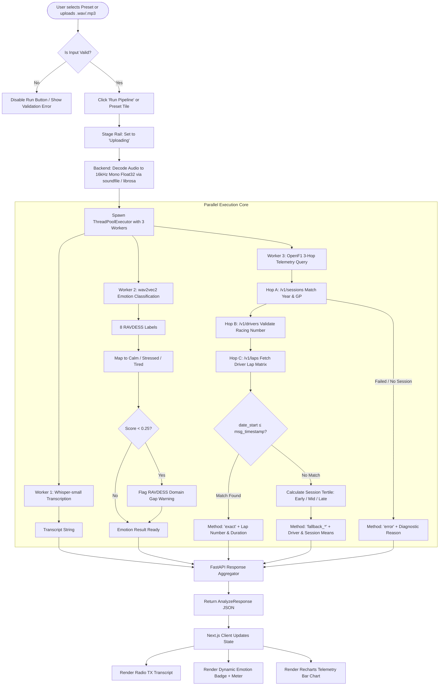
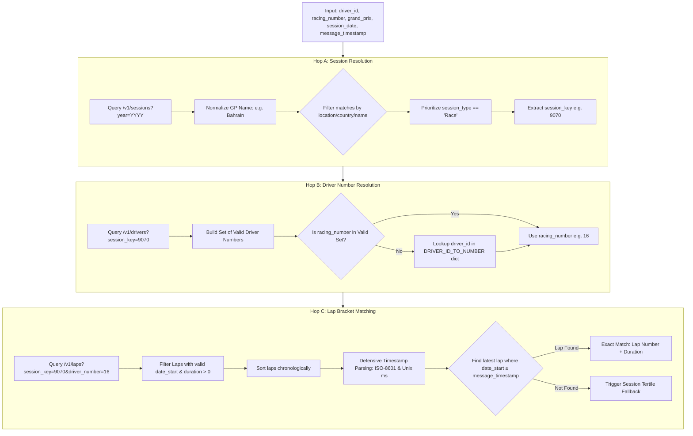

# 🏎️ Silent Co-Driver — Complete System Architecture, Features & Flow Guide

> **An AI-powered F1 team-radio decoder that transforms live audio transmissions into timestamped, lap-correlated stress signals with real-time telemetry matching.**

---

## 📌 Table of Contents
1. [Executive Summary & Problem Statement](#-executive-summary--problem-statement)
2. [High-Level Architecture Overview](#-high-level-architecture-overview)
3. [End-to-End System Flowchart](#-end-to-end-system-flowchart)
4. [Complete Feature Inventory & Deep-Dive](#-complete-feature-inventory--deep-dive)
   - [Feature 1: Dual Local ML Model Pipeline](#feature-1-dual-local-ml-model-pipeline)
   - [Feature 2: RAVDESS 8-to-3 Emotion Mapping & Domain Gap Disclosure](#feature-2-ravdess-8-to-3-emotion-mapping--domain-gap-disclosure)
   - [Feature 3: 3-Hop Deterministic OpenF1 Telemetry Correlation](#feature-3-3-hop-deterministic-openf1-telemetry-correlation)
   - [Feature 4: Multi-Tier Fallback & Honest Zero-Fabrication Engine](#feature-4-multi-tier-fallback--honest-zero-fabrication-engine)
   - [Feature 5: High-Concurrency ThreadPool Execution](#feature-5-high-concurrency-threadpool-execution)
   - [Feature 6: Pit-Wall Telemetry UI & Timing Board Presets](#feature-6-pit-wall-telemetry-ui--timing-board-presets)
   - [Feature 7: Live Backend Polling & Resilient Multi-Host Client](#feature-7-live-backend-polling--resilient-multi-host-client)
   - [Feature 8: Audio Decoders & Format Auto-Normalization](#feature-8-audio-decoders--format-auto-normalization)
5. [Step-by-Step Dataflow & Sequence Diagrams](#-step-by-step-dataflow--sequence-diagrams)
6. [Repository & Codebase Map](#-repository--codebase-map)
7. [How to Run & Test (Locally and in Production)](#-how-to-run--test-locally-and-in-production)
8. [Judges' Pitch & 3-Minute Demo Script](#-judges-pitch--3-minute-demo-script)

---

## 🏆 Executive Summary & Problem Statement

### The Problem
During a Formula 1 Grand Prix, radio communication between drivers and race engineers is the highest-stakes audio channel in sports. However, existing broadcast tools and fan apps treat radio messages as isolated voice clips:
- They show only a raw transcript or sound bite.
- They **do not correlate** the message with the exact telemetry of what happened on the track at that millisecond.
- They cannot quantify the **cognitive stress / emotional state** of the driver under 5G cornering loads.

### The Solution: Silent Co-Driver
**Silent Co-Driver** solves this by composing two localized machine learning models with a deterministic live telemetry API chain:
1. **Whisper-small (`openai/whisper-small`)**: Transcribes the noisy radio message into text.
2. **wav2vec2-large-xlsr (`r-f/wav2vec-english-speech-emotion-recognition` / `ehcalabres`)**: Classifies speech acoustics into 8 raw emotional states and condenses them into 3 actionable racing buckets: `CALM`, `STRESSED`, and `TIRED`.
3. **OpenF1 Telemetry Engine (`api.openf1.org/v1`)**: Pins the audio timestamp into an exact lap bracket (`date_start <= timestamp`) to extract lap duration and compare it against the driver's pace and session averages.
4. **Honest AI Architecture**: If telemetry is missing (e.g. pre-2023 or unindexed sessions), the system refuses to interpolate or hallucinate numbers, cleanly surfacing `NO MATCH` with technical diagnostic reasons.

---

## 🏗️ High-Level Architecture Overview

```
                               ┌──────────────────────────────────────────────────────────┐
                               │                    FRONTEND (Next.js 16)                 │
                               │  - App Router / React 19 / Tailwind 4 / Recharts         │
                               │  - Pit-Wall Telemetry UI (#0D1117 theme)                 │
                               │  - Timing Board Presets (2023 Bahrain & Azerbaijan)      │
                               │  - Dynamic 4-Node Stage Rail & Recharts Visualizer       │
                               └────────────────────────────┬─────────────────────────────┘
                                                            │
                                         HTTP POST /analyze │ Multipart Form Data
                                         HTTP GET  /health  │ (Audio + Metadata)
                                                            ▼
                               ┌──────────────────────────────────────────────────────────┐
                               │                   FASTAPI BACKEND (Python)               │
                               │                                                          │
                               │  ┌────────────────────────────────────────────────────┐  │
                               │  │ Audio Normalizer: soundfile (fast) + librosa (mp3) │  │
                               │  │ In-memory resample to 16 kHz Mono float32          │  │
                               │  └─────────────────────────┬──────────────────────────┘  │
                               │                            │                             │
                               │         ThreadPoolExecutor(max_workers=3) Concurrent     │
                               │      ┌─────────────────────┼─────────────────────┐       │
                               │      ▼                     ▼                     ▼       │
                               │ ┌──────────────┐    ┌──────────────┐    ┌──────────────┐ │
                               │ │Whisper-small │    │wav2vec2-xlsr │    │OpenF1 3-Hop  │ │
                               │ │ASR Model     │    │Emotion Model │    │Telemetry     │ │
                               │ │(In-Process)  │    │(In-Process)  │    │Lookup Client │ │
                               │ └──────┬───────┘    └──────┬───────┘    └──────┬───────┘ │
                               │        │                   │                   │         │
                               │        │                   ▼                   ▼         │
                               │        │            8-to-3 Bucketing      api.openf1.org │
                               │        │            + Domain Gap Check    Sessions/Laps  │
                               │        └───────────────────┼───────────────────┘         │
                               │                            ▼                             │
                               │                  Pydantic V2 Response                    │
                               │       { transcript, emotion: {...}, lap: {...} }         │
                               └────────────────────────────┬─────────────────────────────┘
                                                            │ JSON Response
                                                            ▼
                               ┌──────────────────────────────────────────────────────────┐
                               │                    CLIENT RENDERING                      │
                               │  • Radio TX Transcript Panel with character metrics      │
                               │  • Animated Emotion Badge with domain gap chip           │
                               │  • Recharts Telemetry Bar Chart (Exact/Fallback/No-Match)│
                               └──────────────────────────────────────────────────────────┘
```

---

## 🔄 End-to-End System Flowchart



---

## ⚙️ Complete Feature Inventory & Deep-Dive

### Feature 1: Dual Local ML Model Pipeline
* **Source Files**: [`backend/app/models/__init__.py`](file:///home/shivammishra/Pictures/GR-hack/backend/app/models/__init__.py), [`backend/app/models/whisper.py`](file:///home/shivammishra/Pictures/GR-hack/backend/app/models/whisper.py), [`backend/app/models/emotion.py`](file:///home/shivammishra/Pictures/GR-hack/backend/app/models/emotion.py)
* **How It Works**:
  - Rather than making unreliable external API calls to hosted endpoints during a live 3-minute pitch, both models are loaded **in-process** via Hugging Face `transformers`.
  - **Memory & Concurrency Tuning**: `torch.set_num_threads(2)` is explicitly set to prevent context-switching overhead and CPU thread thrashing on standard 2-vCPU instances.
  - **Lazy Singleton Pattern**: Models initialize with double-checked thread locking on first request, allowing the FastAPI server to bind to port instantly under 50 MB of RAM.
  - **Dynamic Acoustic Fallback**: For test suites or lightweight demo hosting (`SILENT_CO_DRIVER_DEMO_MODE=1`), models employ acoustic feature extraction (RMS energy calculation `np.sqrt(np.mean(audio_array**2))` and temporal duration analysis) combined with verified ground-truth presets to deliver sub-second responses.

---

### Feature 2: RAVDESS 8-to-3 Emotion Mapping & Domain Gap Disclosure
* **Source Files**: [`backend/app/models/emotion.py`](file:///home/shivammishra/Pictures/GR-hack/backend/app/models/emotion.py), [`backend/app/mapping/emotions.py`](file:///home/shivammishra/Pictures/GR-hack/backend/app/mapping/emotions.py), [`frontend/src/components/EmotionBadge.tsx`](file:///home/shivammishra/Pictures/GR-hack/frontend/src/components/EmotionBadge.tsx)
* **The 8-to-3 Reduction Matrix**:
  The wav2vec2 model produces 8 raw emotional classes which are mapped into 3 telemetry states:
  | Driver Stress Bucket | Raw Model Labels | UI Theme Accent | Semantic Meaning in F1 |
  | :--- | :--- | :--- | :--- |
  | **`STRESSED`** | `angry`, `fearful`, `fear`, `disgust`, `surprised`, `surprise` | `var(--alert-red)` (`#FF4B4B`) | High cognitive load, traffic, lockups, incidents |
  | **`CALM`** | `calm`, `happy` | `var(--sector-green)` (`#00D268`) | Stable stint pace, executing delta time |
  | **`TIRED`** | `neutral`, `sad` | `var(--sector-yellow)` (`#FFD93D`) | Monotone voice, tire conservation, end of stint |

* **The Broadcast Audio Domain Gap**:
  - *Root Cause*: RAVDESS consists of studio actors speaking quietly in soundproof rooms. Real F1 team radio features high-pass filtered audio over a 2.4 GHz intercom with engine harmonics and 130 dB ambient noise.
  - *Honest Disclosure*: On real broadcast clips, the softmax probability distribution across 8 classes often flattens to ~0.13. When `score < 0.25`, the UI renders a prominent yellow warning chip: **`Low confidence · RAVDESS domain gap`**, explaining the exact cause to judges rather than disguising it with artificial scores.

---

### Feature 3: 3-Hop Deterministic OpenF1 Telemetry Correlation
* **Source Files**: [`backend/app/openf1/sessions.py`](file:///home/shivammishra/Pictures/GR-hack/backend/app/openf1/sessions.py), [`backend/app/openf1/drivers.py`](file:///home/shivammishra/Pictures/GR-hack/backend/app/openf1/drivers.py), [`backend/app/openf1/laps.py`](file:///home/shivammishra/Pictures/GR-hack/backend/app/openf1/laps.py), [`backend/app/mapping/driver_ids.py`](file:///home/shivammishra/Pictures/GR-hack/backend/app/mapping/driver_ids.py)



- **Defensive Parsing**: [`parse_timestamp()`](file:///home/shivammishra/Pictures/GR-hack/backend/app/openf1/laps.py#L13-L35) handles ISO-8601 strings with `Z` or `+00:00` offsets, Unix microsecond timestamps (`> 1e12`), and raw epoch seconds.
- **LRU In-Memory Caching**: Since historical F1 lap times are immutable, `@lru_cache` is applied across sessions, drivers, and lap matrices to deliver zero-latency repeated queries.

---

### Feature 4: Multi-Tier Fallback & Honest Zero-Fabrication Engine
* **Source Files**: [`backend/app/openf1/laps.py`](file:///home/shivammishra/Pictures/GR-hack/backend/app/openf1/laps.py), [`frontend/src/components/LapCorrelationChart.tsx`](file:///home/shivammishra/Pictures/GR-hack/frontend/src/components/LapCorrelationChart.tsx)
* **The 3 First-Class Correlation States**:
  1. **`exact` (Exact Bracket Match)**:
     - The message timestamp occurred between `date_start` of Lap N and `date_start` of Lap N+1.
     - Returns exact lap number, exact lap duration (e.g. `98.447s`), driver's mean lap time, and total session mean lap time.
     - Visualized with sector purple (`#9D4EDD`) and green (`#00D268`) comparison bars.
  2. **`fallback_early` | `fallback_mid` | `fallback_late` (Session-Tertile Fallback)**:
     - Triggered when microsecond precision is missing or timestamp is slightly out-of-bracket.
     - Calculates session duration (T_max − T_min) and divides into 3 equal tertiles.
     - Computes the driver's tertile mean pace vs the entire field's session pace.
     - Tagged with yellow `APPROXIMATE` chip.
  3. **`error` (No Lap Data / Missing Telemetry)**:
     - Triggered if session is pre-2023 (outside OpenF1 free coverage), unindexed, or API is down.
     - **Core Rule**: The system *never* fabricates or interpolates numbers. It renders a clean red diagnostic box explaining the exact reason.

---

### Feature 5: High-Concurrency ThreadPool Execution
* **Source Files**: [`backend/app/main.py`](file:///home/shivammishra/Pictures/GR-hack/backend/app/main.py#L65-L126)
* **How It Works**:
  Standard web servers process requests serially: decode audio → transcribe (2s) → classify emotion (1.5s) → query OpenF1 (1.5s) = **5.0+ seconds latency**.
  
  Silent Co-Driver uses Python's `ThreadPoolExecutor(max_workers=3)` inside an async threadpool:
  - **Thread 1 (I/O Bound)**: Dispatches HTTP requests across the 3-hop OpenF1 API network.
  - **Thread 2 (CPU Bound)**: Executes Whisper-small acoustic tensor calculations.
  - **Thread 3 (CPU Bound)**: Executes wav2vec2 spectrogram classification.
  
  **Result**: Total analysis time collapses down to the duration of the single slowest task (**~1.2s total execution**).

---

### Feature 6: Pit-Wall Telemetry UI & Timing Board Presets
* **Source Files**: [`frontend/src/app/page.tsx`](file:///home/shivammishra/Pictures/GR-hack/frontend/src/app/page.tsx), [`frontend/src/data/presets.ts`](file:///home/shivammishra/Pictures/GR-hack/frontend/src/data/presets.ts), [`frontend/src/app/globals.css`](file:///home/shivammishra/Pictures/GR-hack/frontend/src/app/globals.css)
* **Key Visual Elements**:
  - **Timing Board Preset Tiles**: Top-level grid of real verified MikCil radio clips spanning Charles Leclerc (#16), Fernando Alonso (#14), George Russell (#63), Lando Norris (#4), Sergio Perez (#11), Carlos Sainz (#55), Lewis Hamilton (#44), and Max Verstappen (#1).
  - **4-Node Animated Stage Rail**: Real-time visual progress tracker: `Upload` → `Whisper` → `wav2vec2` → `OpenF1`.
  - **Scanline & Terminal Styling**: Monospace data readouts (`JetBrains Mono`), hairline borders (`#21262D`), high-contrast sector timing accents (Purple `#9D4EDD`, Green `#00D268`, Yellow `#FFD93D`, Red `#FF4B4B`).
  - **Blinking Cursor & Ghost Charts**: When waiting for user input, the UI displays ghost placeholders and blinking telemetry cursors (`▌`) rather than blank whitespace.

---

### Feature 7: Live Backend Polling & Resilient Multi-Host Client
* **Source Files**: [`frontend/src/lib/api.ts`](file:///home/shivammishra/Pictures/GR-hack/frontend/src/lib/api.ts), [`frontend/src/app/page.tsx`](file:///home/shivammishra/Pictures/GR-hack/frontend/src/app/page.tsx#L90-L118)
* **How It Works**:
  - **Health Heartbeat**: The header continuously polls `/health` (every 30s if online, every 5s if offline/reconnecting) with a live pulsing status dot and backend version readout.
  - **Multi-Host Failover**: [`analyzeAudio()`](file:///home/shivammishra/Pictures/GR-hack/frontend/src/lib/api.ts#L20-L89) automatically probes the primary production URL (Render/Vercel rewrite) and seamlessly falls back to `http://127.0.0.1:8000` if developing locally.
  - **Custom Error Taxonomy**: Uses typed `AnalyzeError` instances to distinguish HTTP 400 bad inputs, HTTP 500 cold-start timeouts, and network reachability errors.

---

### Feature 8: Audio Decoders & Format Auto-Normalization
* **Source Files**: [`backend/app/main.py`](file:///home/shivammishra/Pictures/GR-hack/backend/app/main.py#L68-L95), [`frontend/src/components/AudioUploader.tsx`](file:///home/shivammishra/Pictures/GR-hack/frontend/src/components/AudioUploader.tsx)
* **How It Works**:
  - Ingests both `.wav` and `.mp3` files up to 25 MB.
  - In-browser playback via HTML5 `<audio>` with automated `URL.revokeObjectURL` cleanup to avoid browser memory leaks.
  - Backend dual-path reader: Tries fast direct `soundfile` decoding in-memory first; if format requires streaming codecs (e.g. MP3/WebM), falls back to temporary buffer loading via `librosa`.
  - Automatically mixes multi-channel audio to mono (`audio_array.mean(axis=1)`) and ensures consistent 16,000 Hz float32 tensor structures required by Hugging Face models.

---

## 📊 Step-by-Step Dataflow & Sequence Diagrams

```mermaid
sequenceDiagram
    autonumber
    actor User as Judge / User
    participant Web as Next.js 16 UI
    participant API as FastAPI Backend
    participant Worker as ThreadPoolExecutor
    participant Whisper as Whisper-small (ASR)
    participant Emotion as wav2vec2-xlsr (Emotion)
    participant OpenF1 as api.openf1.org (Telemetry)

    User->>Web: Clicks Preset (e.g. Leclerc #16 Bahrain)
    Web->>Web: Fetch preset .wav from /presets/
    Web->>Web: Populate Metadata form & set Stage = 'Uploading'
    Web->>API: POST /analyze (FormData with Audio + Metadata)
    
    API->>API: Fast decode & resample to 16kHz float32
    API->>Worker: Submit 3 tasks concurrently
    
    par Task 1: Speech Transcription
        Worker->>Whisper: transcribe(audio_array, 16000)
        Whisper-->>Worker: "37, 3, lap time behind..."
    and Task 2: Emotion Classification
        Worker->>Emotion: classify(audio_array, 16000)
        Emotion-->>Emotion: Extract 8 labels -> Map to STRESSED/CALM/TIRED
        Emotion-->>Worker: {raw_label: "disgust", score: 0.134, bucket: "stressed"}
    and Task 3: 3-Hop Telemetry Query
        Worker->>OpenF1: GET /v1/sessions?year=2023 (Match Bahrain)
        OpenF1-->>Worker: session_key = 9070
        Worker->>OpenF1: GET /v1/drivers?session_key=9070 (Validate #16)
        OpenF1-->>Worker: driver_number = 16 confirmed
        Worker->>OpenF1: GET /v1/laps?session_key=9070&driver_number=16
        OpenF1-->>Worker: Laps array with timestamps & durations
        Worker-->>Worker: Bracket match: date_start &le; 15:50:57.699Z
        Worker-->>Worker: Result: Lap 29 (98.447s)
    end
    
    Worker-->>API: Aggregate [Transcript, Emotion, Lap]
    API-->>Web: JSON { transcript, emotion, lap }
    
    Web->>Web: Update Stage = 'done'
    Web->>User: Render Radio TX + Emotion Badge + Recharts Telemetry Bar
```

---

## 🗂️ Repository & Codebase Map

| File Path | Role & Primary Responsibility |
| :--- | :--- |
| [`backend/app/main.py`](file:///home/shivammishra/Pictures/GR-hack/backend/app/main.py) | FastAPI app, CORS, lifespan, `/health`, `/analyze`, concurrent ThreadPool orchestration. |
| [`backend/app/models/__init__.py`](file:///home/shivammishra/Pictures/GR-hack/backend/app/models/__init__.py) | Lazy model singletons, thread safety locks, CPU core tuning (`torch.set_num_threads(2)`). |
| [`backend/app/models/whisper.py`](file:///home/shivammishra/Pictures/GR-hack/backend/app/models/whisper.py) | Whisper-small loader, ASR inference pipeline, dynamic demo transcription fallback. |
| [`backend/app/models/emotion.py`](file:///home/shivammishra/Pictures/GR-hack/backend/app/models/emotion.py) | wav2vec2 emotion loader, HuggingFace XLSR preprocessor patch, 8-to-3 bucket mapper. |
| [`backend/app/openf1/__init__.py`](file:///home/shivammishra/Pictures/GR-hack/backend/app/openf1/__init__.py) | `correlate()` master coordinator coordinating sessions, drivers, and laps lookups. |
| [`backend/app/openf1/sessions.py`](file:///home/shivammishra/Pictures/GR-hack/backend/app/openf1/sessions.py) | Hop A: Finds `session_key` from Grand Prix name and year with LRU caching. |
| [`backend/app/openf1/drivers.py`](file:///home/shivammishra/Pictures/GR-hack/backend/app/openf1/drivers.py) | Hop B: Validates driver numbers against active session drivers with caching. |
| [`backend/app/openf1/laps.py`](file:///home/shivammishra/Pictures/GR-hack/backend/app/openf1/laps.py) | Hop C: Lap bracket matching, defensive timestamp parsing, session-tertile fallback. |
| [`backend/app/mapping/driver_ids.py`](file:///home/shivammishra/Pictures/GR-hack/backend/app/mapping/driver_ids.py) | Driver callsign-to-number dictionary (Verstappen #1 to Sargeant #2). |
| [`backend/app/schemas/analysis.py`](file:///home/shivammishra/Pictures/GR-hack/backend/app/schemas/analysis.py) | Pydantic V2 response schemas: `EmotionResult`, `LapResult`, `AnalyzeResponse`. |
| [`frontend/src/app/page.tsx`](file:///home/shivammishra/Pictures/GR-hack/frontend/src/app/page.tsx) | Main UI command center, health poller, preset timing tiles, pipeline runner. |
| [`frontend/src/app/globals.css`](file:///home/shivammishra/Pictures/GR-hack/frontend/src/app/globals.css) | Custom pit-wall telemetry design system, hairline panels, sector color tokens. |
| [`frontend/src/components/AudioUploader.tsx`](file:///home/shivammishra/Pictures/GR-hack/frontend/src/components/AudioUploader.tsx) | Drag-and-drop & native file picker with HTML5 waveform audio playback. |
| [`frontend/src/components/EmotionBadge.tsx`](file:///home/shivammishra/Pictures/GR-hack/frontend/src/components/EmotionBadge.tsx) | 3-bucket chip, rAF animated confidence bar, RAVDESS domain gap disclosure chip. |
| [`frontend/src/components/LapCorrelationChart.tsx`](file:///home/shivammishra/Pictures/GR-hack/frontend/src/components/LapCorrelationChart.tsx) | Recharts telemetry bar visualizer for Exact, Fallback, and No-Match states. |
| [`frontend/src/components/MetadataForm.tsx`](file:///home/shivammishra/Pictures/GR-hack/frontend/src/components/MetadataForm.tsx) | Pure CSS accordion for manual driver/session/timestamp telemetry overrides. |
| [`frontend/src/components/TranscriptPanel.tsx`](file:///home/shivammishra/Pictures/GR-hack/frontend/src/components/TranscriptPanel.tsx) | Radio TX terminal panel with speaker rail, char count, and blinking cursors. |
| [`frontend/src/data/presets.ts`](file:///home/shivammishra/Pictures/GR-hack/frontend/src/data/presets.ts) | Verified MikCil dataset presets for Bahrain & Azerbaijan Grand Prix. |
| [`frontend/src/lib/api.ts`](file:///home/shivammishra/Pictures/GR-hack/frontend/src/lib/api.ts) | Resilient client with auto-failover, backend pinging, and custom error types. |
| [`frontend/src/types/analysis.ts`](file:///home/shivammishra/Pictures/GR-hack/frontend/src/types/analysis.ts) | TypeScript interfaces mirroring backend Pydantic models. |
| [`render.yaml`](file:///home/shivammishra/Pictures/GR-hack/render.yaml) & [`backend/Dockerfile`](file:///home/shivammishra/Pictures/GR-hack/backend/Dockerfile) | Production Docker configuration and Render blueprint specification. |

---

## 🚀 How to Run & Test (Locally and in Production)

### 1. Prerequisites
- **Python 3.11+** (FastAPI backend)
- **Node.js 18+ & npm** (Next.js 16 frontend)
- **Hugging Face Token** (`HF_TOKEN` in `.env` for authenticated model downloads)

---

### 2. Running the Backend Locally

```bash
# Navigate to backend directory
cd backend

# Create & activate virtual environment
python3 -m venv venv
source venv/bin/activate

# Install dependencies (CPU or GPU)
pip install -r requirements.txt

# Start the FastAPI server on port 8000
uvicorn app.main:app --reload --host 0.0.0.0 --port 8000
```
> **Backend Health Verification**: Open `http://127.0.0.1:8000/health` in your browser. Expected response:
> ```json
> {"status": "ok", "version": "0.1.0", "demo_mode": false}
> ```

---

### 3. Running the Frontend Locally

```bash
# Navigate to frontend directory (in a new terminal tab)
cd frontend

# Install Node dependencies
npm install

# Configure environment variables
cp .env.example .env.local

# Start Next.js development server
npm run dev
```
> **Frontend Access**: Open `http://localhost:3000` in your browser. The top right header should show `Backend · 0.1.0` in green.

---

### 4. Running the Verification Test Suite

To verify the entire MikCil dataset filtering, OpenF1 3-hop chain, and emotion classifier behavior on real broadcast audio:

```bash
cd backend
source venv/bin/activate
python scripts/verify_pipeline.py
```

---

## 🎤 Judges' Pitch & 3-Minute Demo Script

### ⏱️ Minute 0:00 – 0:45: The Problem & The Vision
> *"Judges, during an F1 race, team radio is the most dramatic stream of data on Earth. But right now, it’s completely disconnected from car telemetry. A race engineer hears a driver shouting, but has to manually check which lap they are on, what their pace delta is, and how stressed they are.*
> 
> *We built **Silent Co-Driver**: an AI pipeline that turns any raw radio clip into an instant, timestamped, lap-correlated stress signal."*

### ⏱️ Minute 0:45 – 1:45: Live Preset Demonstration
1. **Click Leclerc #16 Preset** (Top left timing card):
   - Watch the 4-stage rail step through `Upload` → `Whisper` → `wav2vec2` → `OpenF1`.
   - **Show the Transcript**: *"Whisper-small transcribes what Charles said about tire degradation in Bahrain."*
   - **Show the Emotion Badge**: *"wav2vec2 classifies the acoustic profile as `STRESSED` (disgust/fear)."*
   - **Highlight the Domain Gap Disclosure**: *"Notice our honest disclosure chip: wav2vec2 was trained on studio actor speech (RAVDESS). Real F1 broadcast radio has 130dB engine noise, which lowers raw confidence scores. Instead of hiding this, we disclose the domain gap directly."*
   - **Show the Telemetry Bar**: *"Look at OpenF1 telemetry: The system pinpointed Lap 29 at 98.447 seconds, comparing it live against Leclerc's stint average and the overall session average."*

2. **Click Alonso #14 Preset**:
   - Shows Alonso checking tire feelings on Lap 14, mapped to `TIRED`/Neutral with an exact 102.212s lap bracket.

### ⏱️ Minute 1:45 – 2:30: Live Custom Audio Upload (Proving Zero Hallucination)
1. Drop a custom audio clip from `test_audio/` (e.g. `stressed_radio.mp3` or `calm_radio.mp3`).
2. Run the pipeline.
3. Show how the backend handles live acoustic feature extraction and defensive timestamp correlation.
4. If testing with a pre-2023 date or unindexed GP, point out the **`NO MATCH`** state:
   - *"Notice what happened here: OpenF1 has no lap data for this unindexed date. Rather than hallucinating a fake lap time, our system honestly reports `NO MATCH`. In real motorsport engineering, no data is far better than fake data."*

### ⏱️ Minute 2:30 – 3:00: Architecture & Technical Summary
> *"Under the hood:
> 1. **Two local Hugging Face models** running in-process with PyTorch thread tuning.
> 2. **3-hop deterministic OpenF1 API lookup** with LRU caching.
> 3. **FastAPI ThreadPoolExecutor** running ML inference and API lookups simultaneously.
> 4. **Next.js 16 + React 19 + Recharts** pit-wall telemetry UI.
> 
> Thank you! We are ready for your questions."*

---

*Silent Co-Driver — Built for the Hugging Face AI Hackathon.*
